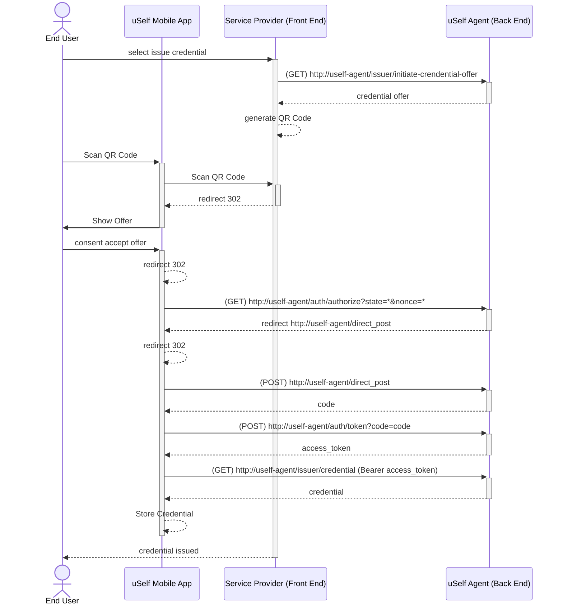
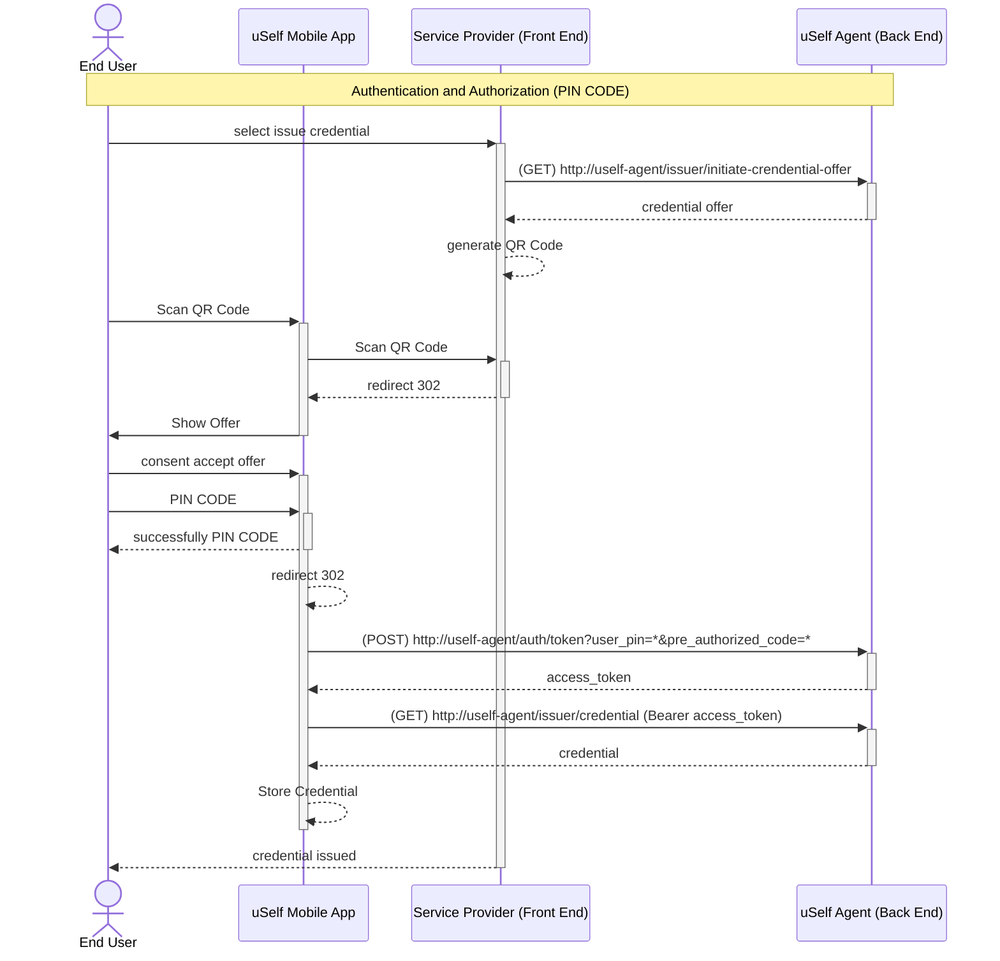
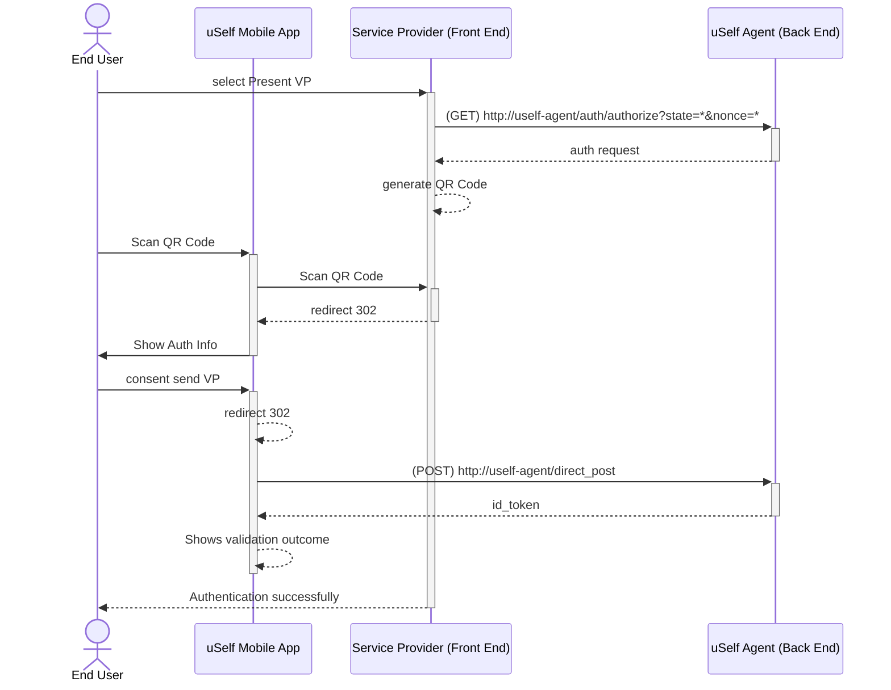

    # Ledger uSelf Agent
## Table of Contents
- [Description](#Description)
- [Documentation](#Documentation)
  - [Getting started](#Getting-started)
  - [Issue Credentials following OpenID 4 VCI](#Issue-Credentials-following-OpenID-4-VCI)
      - [No Authorized Issue Credential](#No-Authorized-Issue-Credential)
      - [PreAuthorized Issue Credential](#PreAuthorized-Issue-Credential)
    - [Present Verifiable Presentation following OpenID 4 VP](#Present-Verifiable-Presentation-following-OpenID-4-VP)
- [License](#License)


## Description
**uSelf Agent** provides Self Sovereign Identity functionalities following the standards for managing Verifiable Credentials and Decentralised Identifiers. The main standards used :
- [W3C Verifiable Credentials Data Model](https://www.w3.org/TR/vc-data-model-2.0)
- [Decentralised Identifiers (DID)](https://www.w3.org/TR/did-core)
- [EBSI conformance test v3.2](https://hub.ebsi.eu/conformance/standards-versions)
  - [OpenID Connect for Verifiable Credentials Issue draft 11 (OpenID4VCI)](https://openid.net/specs/openid-4-verifiable-credential-issuance-1_0-11.html#name-credential-issuer-metadata-5)
  - [OpenID Connect for Verifiable  Presentation draft 14 (OpenID4VP)](https://openid.net/specs/openid-4-verifiable-presentations-1_0-14.html)

- [OpenID Connect for Verifiable Credentials Issue (OpenID4VCI)](https://openid.net/specs/openid-4-verifiable-credential-issuance-1_0.html)
- [OpenID Connect for Verifiable  Presentation (OpenID4VP)](https://openid.net/specs/openid-4-verifiable-presentations-1_0.html)
- [Self-Issued OpenID Provider v2 (SIOP)](https://openid.github.io/SIOPv2/openid-connect-self-issued-v2-wg-draft.html)

In addition to the standards, **uSelf Agent** follows the recommendations of the [European Blockchain Services Infrastructure (EBSI)](https://ec.europa.eu/digital-building-blocks/sites/display/EBSI) and the [eIDAS 2.0](https://github.com/eu-digital-identity-wallet/eudi-doc-architecture-and-reference-framework/blob/main/docs/arf.md).

## Documentation
As mentioned above, **uSelf Agent** provides Self Sovereign Identity functionalities. The main functionalities can be divided on the following categories:

### Getting started 
In order to run the **uSelf Agent**, it is necessary to have a running instance of Redis database. Therefore, before starting the system you need to run the following command:
```bash
docker compose up
```
Once the redis service is available, you can start the **uSelf Agent** by running the following command:
```bash
./gradlew bootJar
java -jar build/libs/uself-agent-0.0.1-SNAPSHOT.jar
```

Finally, you can access the **uSelf Agent** at the following URL: [http://localhost:8888](http://localhost:8888).

### Issue Credentials following OpenID 4 VCI

#### No Authorized Issue Credential
The **uSelf Agent** implementation for No Authorized Issue Credential is based on the [OpenID Connect for Verifiable Credentials Issue](https://openid.net/specs/openid-4-verifiable-credential-issuance-1_0.html).
As the end user hasn't been authenticated and authorized, the process of Issue Credential is based on the use of a QR Code to redirect the end user to the **uSelf Agent**.
From that moment on, the end user can, using the **uSelf Mobile App**, scan the QR Code and accept the offer of the credential.
The following diagram shows the sequence of the No Authorized Issue Credential process.

#### PreAuthorized Issue Credential
Where in this particular case, the authentication and authorization is done previously, therefor it is not necessary to perform it again. 
Thereby to assure the security of the process, the **uSelf Agent** implementation for PreAuthorized Issue Credential is based on the use of a PIN Code provided to the end user.
The following diagram shows the sequence of the PreAuthorized Issue Credential process.


### Present Verifiable Presentation following OpenID 4 VP
The **uSelf Agent** implementation for Present Verifiable Presentation is based on the [OpenID Connect for Verifiable Presentations](https://openid.net/specs/openid-4-verifiable-presentations-1_0.html).
As one of the main differences with the Issue Credential process, the Present Verifiable Presentation process is based on the use of a QR Code to redirect the end user to the **uSelf Agent** obtaining from an authorization request instead of using a credential offer.

Further information about the details of the implementation can be found in the [uSelf Agent documentation](https://uself-agent.readthedocs.io/en/latest/).
## License
* [Apache License, Version 2.0](https://www.apache.org/licenses/LICENSE-2.0)

  
This software contains some depencies with other libraries detailed within the Notice.txt file which also includes the license texts. 
